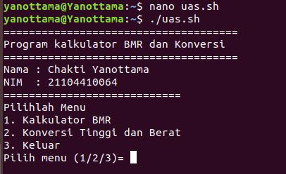

# # Data Diri

|  |  |
|--|--|
| NIM | *21104410064* |
| Nama Lengkap | *Chakti Yanottama* |
| Kelas | TI-4B |
| Dosen Pengampu | [Mohammad Faried Rahmat, S.ST., M.Tr.T](https://github.com/mrhmt80) |

## SISTEM OPERASI
Fitur : 
|   |  |
|--|--|
| *Fitur* | *Detail* |
| Kalkulator BMR | Digunakan untuk menghitung berapa banyak asupan kalori yang harus dipenuhi dalam 1 hari |
| Konversi Tinggi Badan dan Berat Badan | Digunakan untuk membantu pengkorvesian berat badan dari kilogram ke pound dan untuk tinggi badan dari sentimeter ke feet (kaki) |

### SCREENSHOT PROGRAM

